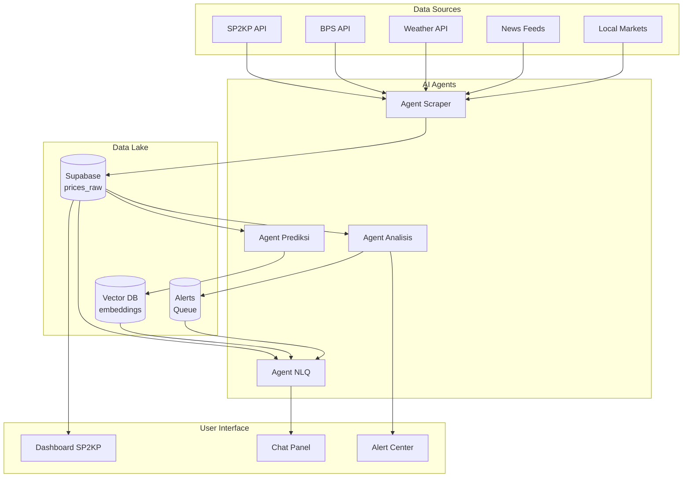

# Agent Instructions — PanganArbitrage V2

> **Version**: 1.0  
> **Last Updated**: 30 April 2026  
> **Stack**: Next.js 14 App Router · TypeScript · Supabase · Tailwind 3 · Recharts · Vercel AI SDK

---

## 1. Aturan Kode (Wajib)

| # | Aturan | Severity |
|---|--------|----------|
| 1 | **Tailwind only** — Gunakan utility classes. Hindari inline `style={{}}` dan custom CSS (`.l1-row`, `.pill`). Exception: animasi kompleks & CSS variables. | 🔴 High |
| 2 | **No duplication** — Cek `lib/analytics/metrics.ts` sebelum menulis logic baru. Konstanta business logic (HET_THRESHOLD, province mapping) ada di `lib/constants.ts`. | 🔴 High |
| 3 | **File size limit** — Komponen page > 200 baris HARUS dipecah ke sub-komponen. | 🔴 High |
| 4 | **Pure functions must have tests** — Parser, metrics, date utilities wajib punya unit test. | 🔴 High |
| 5 | **Use `useSWR`** — Jangan `fetch` langsung di komponen. Cache key harus konsisten. | 🟡 Medium |
| 6 | **Error boundaries** — WAJIB di setiap page level (`app/dashboard/*/page.tsx`). | 🟡 Medium |
| 7 | **AI tools di `lib/ai/tools.ts`** — Jangan hardcode tool definitions di page atau API route. | 🟡 Medium |
| 8 | **Type safety** — Hindari `any`. Recharts props harus dityping proper. | 🟠 Low |

---

## 2. Struktur Folder

```
PanganArbitrageV2/
├── app/                          # Next.js App Router — orchestrators only
│   ├── api/
│   │   ├── chat/                 # AI NLQ endpoint (Vercel AI SDK)
│   │   ├── agents/
│   │   │   ├── scraper/          # Agent Scraper cron endpoint
│   │   │   ├── anomaly/          # Agent Analisis cron endpoint
│   │   │   └── prediction/       # Agent Prediksi cron endpoint
│   │   └── ...                   # Existing API routes
│   └── dashboard/
│       ├── layout.tsx            # Error boundary + SWR provider
│       └── ...
├── components/
│   ├── layout/                   # Topbar, Sidebar, ErrorBoundary
│   ├── sp2kp/                    # SP2KP feature components
│   ├── charts/                   # Recharts wrappers
│   ├── ai/                       # AI-specific UI components
│   │   ├── ChatPanel.tsx         # NLQ chat interface
│   │   ├── SuggestionChips.tsx   # Quick action buttons
│   │   └── AgentStatusBadge.tsx  # Status indicator
│   └── ...
├── lib/
│   ├── ai/                       # ⬅️ AI Agent core
│   │   ├── tools.ts              # Tool definitions (Zod schema)
│   │   ├── prompts.ts            # System prompts per agent
│   │   ├── orchestrator.ts       # Agent coordination logic
│   │   └── embeddings.ts         # Vector DB operations
│   ├── analytics/
│   │   └── metrics.ts            # Pure calculation functions
│   ├── constants.ts              # HET_THRESHOLD, province mapping, etc.
│   ├── csv/
│   │   └── sp2kp-parser.ts       # CSV/XLSX parser
│   ├── supabase/
│   │   ├── client.ts             # Browser client
│   │   └── server.ts             # Server client (service role)
│   └── utils/
│       └── date.ts               # Indonesian date formatters
├── types/
│   ├── sp2kp.ts                  # Existing SP2KP types
│   └── ai.ts                     # AI agent types
├── tests/
│   ├── parser.test.ts            # Parser unit tests
│   ├── metrics.test.ts           # Metrics unit tests
│   └── date.test.ts              # Date utility tests
└── AGENTS.md                     # This file
```

---

## 3. AI Agent Architecture

Berdasarkan diagram arsitektur PanganArbitrage V2, terdapat **4 agent** yang berjalan:

### 3.1 Agent Scraper (Web Data Extractor)

**Role**: Mengumpulkan data harga pangan dari berbagai sumber eksternal.

**Sumber Data**:
- National Price APIs (SP2KP, BPS, dll)
- Local Markets data (spreadsheet upload)
- News/Weather feeds (cuaca, berita pertanian)
- Crop Weather feeds (data tanaman & cuaca)

**Trigger**: Vercel Cron (setiap 6 jam) atau manual trigger.

**Output**: Raw data ke Supabase (`prices_raw`, `external_sources`).

**Key File**:
```
app/api/agents/scraper/route.ts
```

### 3.2 Agent Analisis Anomali & Arbitrase (Profit Scout)

**Role**: Mendeteksi anomali harga dan opportunity arbitrase antar wilayah.

**Logic**:
1. Fetch latest prices dari `get_sp2kp_latest()`
2. Hitung price spread antar kota (Java → Bali, dll)
3. Bandingkan dengan HET threshold (`HET_ANOMALY_THRESHOLD = 1.02`)
4. Hitung biaya transport dari `transport_vendors`
5. Generate arbitrage alert jika profit > threshold

**Trigger**: Real-time saat data baru masuk, atau cron (setiap jam).

**Output**: 
- `arbitrage_alerts` table
- Notifikasi ke dashboard (WebSocket/SSE)

**Key Files**:
```
lib/ai/agents/anomaly.ts
app/api/agents/anomaly/route.ts
```

### 3.3 Agent Prediksi Tren & Sentimen (Oracle)

**Role**: Prediksi harga masa depan dan analisis sentimen pasar.

**Input**:
- Historical price data (1 tahun)
- News/Weather feeds (sentiment analysis)
- Supply chain insights

**Output**:
- Price prediction (7 hari, 30 hari)
- Trend direction (UP/DOWN/STABLE)
- Sentiment score
- Confidence level

**Trigger**: Cron (setiap hari pagi) atau on-demand via chat.

**Key Files**:
```
lib/ai/agents/prediction.ts
app/api/agents/prediction/route.ts
```

### 3.4 Agent Natural Language Query (The Concierge)

**Role**: Chat interface untuk user bertanya tentang data pangan.

**Contoh Interaksi**:
```
User: "Harga beras di Surabaya 30 hari terakhir?"
Agent: [fetch data] → render chart

User: "Cari opportunity arbitrase cabai"
Agent: [call Analisis agent] → tampilkan rute profit

User: "Prediksi harga bawang minggu depan"
Agent: [call Prediksi agent] → tampilkan forecast
```

**Stack**: Vercel AI SDK (`streamText`, `maxSteps`, `tool`).

**Key Files**:
```
app/api/chat/route.ts
components/ai/ChatPanel.tsx
lib/ai/tools.ts
lib/ai/prompts.ts
```

---

## 4. Tool Definitions (`lib/ai/tools.ts`)

```typescript
import { tool } from 'ai';
import { z } from 'zod';

export const tools = {
  // Data Query Tools
  getPriceSeries: tool({
    description: "Ambil data harga harian komoditas di kota tertentu",
    parameters: z.object({
      kodeWilayah: z.string().describe("Kode BPS wilayah, e.g. '3171'"),
      commodityId: z.number().describe("ID komoditas dari tabel commodities"),
      days: z.number().default(30).describe("Jumlah hari ke belakang")
    }),
    execute: async ({ kodeWilayah, commodityId, days }) => {
      // Query Supabase prices_raw
    }
  }),

  getLatestPrices: tool({
    description: "Ambil harga terbaru semua komoditas di provinsi/island",
    parameters: z.object({
      island: z.enum(['Jawa', 'Madura', 'Bali', 'Lombok']).optional(),
      province: z.string().optional()
    }),
    execute: async ({ island, province }) => {
      // Panggil RPC get_sp2kp_latest
    }
  }),

  // Analisis Tools
  calculateArbitrage: tool({
    description: "Hitung arbitrase antar kota untuk komoditas tertentu",
    parameters: z.object({
      fromCity: z.string().describe("Kode wilayah asal"),
      toCity: z.string().describe("Kode wilayah tujuan"),
      commodityId: z.number(),
      transportMode: z.enum(['truck', 'ship', 'train']).optional()
    }),
    execute: async ({ fromCity, toCity, commodityId, transportMode }) => {
      // Hitung profit = price_diff - transport_cost - margin
    }
  }),

  detectAnomaly: tool({
    description: "Deteksi anomali harga (di atas HET atau fluktuasi ekstrem)",
    parameters: z.object({
      kodeWilayah: z.string(),
      commodityId: z.number(),
      threshold: z.number().default(1.02)
    }),
    execute: async ({ kodeWilayah, commodityId, threshold }) => {
      // Cek price > HET * threshold
    }
  }),

  // Prediksi Tools
  getPricePrediction: tool({
    description: "Prediksi harga komoditas di masa depan",
    parameters: z.object({
      kodeWilayah: z.string(),
      commodityId: z.number(),
      daysAhead: z.number().default(7),
      includeWeather: z.boolean().default(true)
    }),
    execute: async ({ kodeWilayah, commodityId, daysAhead, includeWeather }) => {
      // ML model atau time-series forecasting
    }
  }),

  getSentimentAnalysis: tool({
    description: "Analisis sentimen pasar dari news/weather feeds",
    parameters: z.object({
      commodityId: z.number(),
      daysBack: z.number().default(7)
    }),
    execute: async ({ commodityId, daysBack }) => {
      // NLP sentiment analysis
    }
  }),

  // Scraper Tools
  triggerScraper: tool({
    description: "Trigger manual scraper untuk sumber data tertentu",
    parameters: z.object({
      source: z.enum(['sp2kp', 'bps', 'weather', 'news']),
      forceRefresh: z.boolean().default(false)
    }),
    execute: async ({ source, forceRefresh }) => {
      // Panggil scraper agent
    }
  })
};
```

---

## 5. System Prompts (`lib/ai/prompts.ts`)

### 5.1 NLQ Agent Prompt

```typescript
export const nlqSystemPrompt = `Kamu adalah PanganBot, asisten AI untuk PanganArbitrage V2 — dashboard pemantauan harga komoditas pangan Indonesia.

KEMAMPUAN:
- Query harga real-time dari data SP2KP (Jawa, Madura, Bali, Lombok)
- Analisis tren harga (7/30/90 hari)
- Deteksi anomali harga (di atas HET)
- Kalkulasi arbitrase antar kota
- Prediksi harga pendek (7 hari ke depan)
- Analisis sentimen pasar dari berita/cuaca

ATURAN:
1. Selalu gunakan tool untuk mengambil data, jangan tebak.
2. Format angka harga dalam Rupiah (Rp 15.000/kg).
3. Jika data tidak tersedia, jelaskan alasannya.
4. Untuk prediksi, sertakan confidence level (%) dan disclaimer.
5. Bahasa default: Indonesia. User bisa switch ke English.

KONTEKS DOMAIN:
- 17 komoditas pokok: beras, cabai, bawang merah, bawang putih, daging sapi, daging ayam, telur, gula pasir, minyak goreng, dsb.
- HET = Harga Eceran Tertinggi (batas atas harga normal).
- Arbitrase = selisih harga antar kota dikurangi biaya transport.
`;
```

### 5.2 Analisis Agent Prompt

```typescript
export const anomalySystemPrompt = `Kamu adalah Profit Scout, agent analisis anomali dan arbitrase.

TUGAS:
1. Identifikasi harga yang melebihi HET (> 2% threshold).
2. Temukan price spread signifikan antar kota (> 10% dari rata-rata).
3. Hitung opportunity arbitrase: profit = price_diff - transport_cost.
4. Prioritaskan alert berdasarkan: profit margin, volume, reliability.

OUTPUT FORMAT:
{
  "alerts": [
    {
      "type": "anomaly" | "arbitrage",
      "severity": "high" | "medium" | "low",
      "commodity": "string",
      "locations": ["kota_asal", "kota_tujuan"],
      "priceSpread": number,
      "profitMargin": number,
      "confidence": number,
      "action": "string"
    }
  ]
}
`;
```

### 5.3 Prediksi Agent Prompt

```typescript
export const predictionSystemPrompt = `Kamu adalah Oracle, agent prediksi tren harga pangan.

TUGAS:
1. Analisis time-series harga historis (30-90 hari).
2. Integrasi data eksternal: cuaca, musim panen, berita.
3. Generate forecast 7 hari ke depan dengan confidence interval.
4. Berikan insight sentimen pasar (bullish/bearish/neutral).

METODOLOGI:
- Gunakan exponential smoothing untuk short-term forecast.
- Weighted average: 60% historical, 25% weather, 15% sentiment.
- Confidence interval: ±5% untuk 3 hari, ±12% untuk 7 hari.

OUTPUT FORMAT:
{
  "commodity": "string",
  "forecast": [
    { "date": "YYYY-MM-DD", "predictedPrice": number, "confidence": number }
  ],
  "trend": "UP" | "DOWN" | "STABLE",
  "sentiment": "bullish" | "bearish" | "neutral",
  "factors": ["string"],
  "disclaimer": "string"
}
`;
```

---

## 6. Data Flow & Orchestration



---

## 7. Implementation Checklist

### Phase 1: Foundation (Sekarang)
- [ ] Buat `lib/ai/` folder structure
- [ ] Implement `tools.ts` dengan 7 tool definitions
- [ ] Setup `app/api/chat/route.ts` (Vercel AI SDK)
- [ ] Buat `ChatPanel.tsx` UI component
- [ ] Extract constants ke `lib/constants.ts`

### Phase 2: Agent Scraper
- [ ] Buat `app/api/agents/scraper/route.ts`
- [ ] Implement SP2KP API client
- [ ] Setup Vercel Cron (6 jam)
- [ ] Error handling & retry logic

### Phase 3: Agent Analisis
- [ ] Buat `lib/ai/agents/anomaly.ts`
- [ ] Implement price spread calculation
- [ ] Integrasi transport cost dari `transport_vendors`
- [ ] Alert notification system (SSE/WebSocket)

### Phase 4: Agent Prediksi
- [ ] Buat `lib/ai/agents/prediction.ts`
- [ ] Time-series model (simple exponential smoothing)
- [ ] Weather data integration
- [ ] Sentiment analysis pipeline

### Phase 5: Polish
- [ ] Unit tests untuk semua pure functions
- [ ] Error boundaries di semua page
- [ ] Loading skeletons
- [ ] Auth middleware untuk ingest/admin

---

## 8. Contoh Penggunaan

### Chat dengan Agent NLQ

```tsx
// components/ai/ChatPanel.tsx
'use client';

import { useChat } from 'ai/react';

export function ChatPanel() {
  const { messages, input, handleInputChange, handleSubmit } = useChat({
    api: '/api/chat',
    maxSteps: 5, // Agent bisa call multiple tools
  });

  return (
    <div className="flex flex-col h-full">
      <div className="flex-1 overflow-y-auto p-4 space-y-4">
        {messages.map(m => (
          <div key={m.id} className={m.role === 'user' ? 'text-right' : 'text-left'}>
            <div className={`inline-block p-3 rounded-lg ${
              m.role === 'user' ? 'bg-blue-600 text-white' : 'bg-gray-100'
            }`}>
              {m.content}
              {m.toolInvocations?.map(tool => (
                <div key={tool.toolCallId} className="mt-2 text-sm opacity-75">
                  🔧 Menggunakan: {tool.toolName}
                </div>
              ))}
            </div>
          </div>
        ))}
      </div>

      <form onSubmit={handleSubmit} className="p-4 border-t">
        <input
          value={input}
          onChange={handleInputChange}
          placeholder="Tanya tentang harga pangan..."
          className="w-full p-3 border rounded-lg"
        />
      </form>
    </div>
  );
}
```

### API Route untuk Chat

```tsx
// app/api/chat/route.ts
import { openai } from '@ai-sdk/openai';
import { streamText } from 'ai';
import { tools } from '@/lib/ai/tools';
import { nlqSystemPrompt } from '@/lib/ai/prompts';

export async function POST(req: Request) {
  const { messages } = await req.json();

  const result = streamText({
    model: openai('gpt-4o'),
    system: nlqSystemPrompt,
    messages,
    tools,
    maxSteps: 5,
  });

  return result.toDataStreamResponse();
}
```

---

## 9. Troubleshooting untuk Agent

| Masalah | Solusi |
|---------|--------|
| Agent tidak menemukan tool | Pastikan `tools.ts` di-export dan di-import di `route.ts` |
| Tool call gagal | Cek Zod schema — parameter harus sesuai dengan yang diharapkan |
| Response terlalu lambat | Gunakan `maxSteps` rendah (3-5) untuk simple query |
| Hallucination | Selalu gunakan tool untuk data, jangan minta LLM menebak harga |
| Context window penuh | Pecah conversation, atau gunakan summary untuk chat panjang |

---

*Dokumen ini hidup — update sesuai perubahan arsitektur.*
