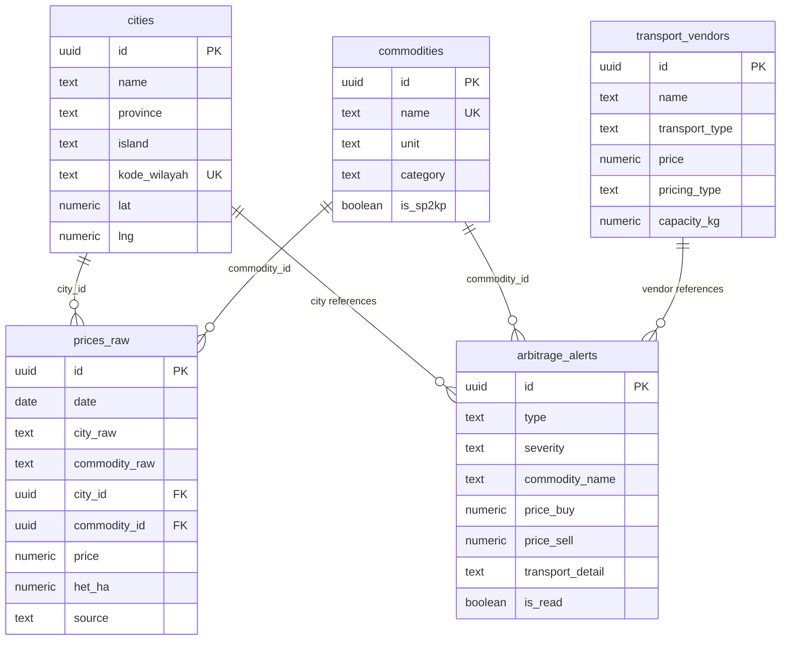

# 🏗️ PanganArbitrage V2 — Blueprint Summary & Code Review

> **Project**: Commodity Price Dashboard & Arbitrage Analytics
> **Tanggal Review**: 2 Mei 2026
> **Stack**: Next.js 14 · TypeScript · Supabase · Tailwind 3 · Recharts · Gemini Flash
> **Deploy**: Vercel Hobby ($0) · AI: Gemini Flash ($0)

---

## 📋 Table of Contents

1. [Project Overview](#1-project-overview)
2. [Architecture Blueprint](#2-architecture-blueprint)
3. [Tech Stack & Dependencies](#3-tech-stack--dependencies)
4. [Database Schema](#4-database-schema)
5. [Source Code Structure](#5-source-code-structure)
6. [Feature Inventory](#6-feature-inventory)
7. [Build Phase Progress](#7-build-phase-progress)
8. [Code Review & Scoring](#8-code-review--scoring)
9. [Recommendations](#9-recommendations)

---

## 1. Project Overview

**PanganArbitrage V2** adalah dashboard analitik harga komoditas pangan di Indonesia, mencakup wilayah **Jawa, Madura, Bali, dan Lombok**. Sistem ini mengingest data dari sumber pemerintah (SP2KP), menganalisis perbedaan harga antar kota, dan mendeteksi peluang arbitrase — termasuk estimasi biaya transport, risiko logistik, dan rekomendasi AI.

### Visi Produk

```
┌─────────────────────────────────────────────────────────────────────┐
│  PHASE 1 (✅ ~90%)     │  PHASE 2 (✅ ~85%)    │  PHASE 3 (⚪)     │
│  SP2KP Data Pipeline   │  AI Arbitrage         │  Full Agentic     │
│  + Dashboard Core      │  Detection +          │  System: Hermes + │
│  + Transport Vendors   │  Logistics Risk       │  4 Workers + NLQ  │
└─────────────────────────────────────────────────────────────────────┘
```

### Target Users
- **Pedagang/Trader**: Identifikasi peluang arbitrase komoditas antar kota
- **Analis Pangan**: Monitoring harga, deteksi anomali HET
- **Admin**: Data ingestion, naming review, transport vendor management

---

## 2. Architecture Blueprint

### Data Flow

```mermaid
graph LR
    A[SP2KP CSV/XLSX] -->|Parser| B[/api/ingest/sp2kp]
    B -->|Bulk Insert| C[(Supabase: prices_raw)]
    C --> D[/api/sp2kp/latest]
    D --> E[SP2KP Dashboard]
    
    C --> F[/api/agents/arbitrage]
    G[(transport_vendors)] --> F
    F -->|Layer 1: Statistical| H[detectAnomalies + findArbitrage]
    H -->|Layer 2: AI| I[Gemini Flash]
    I --> J[(arbitrage_alerts)]
    J --> K[Alert Center UI]
    
    L[Admin] -->|CRUD| G
    L -->|Upload| A
```

### Rendering Strategy

| Layer | Strategy | Detail |
|-------|----------|--------|
| **Pages** | Client-side (`"use client"`) | SSR disabled; semua page client-rendered |
| **Data Fetching** | `fetch` + `useState` | Langsung di component, tidak pakai SWR |
| **State** | Local React state | Tidak ada global state management |
| **Layout** | App Router nested layout | Sidebar + Topbar persistent via `dashboard/layout.tsx` |

### API Layer

| Route | Method | Fungsi |
|-------|--------|--------|
| `/api/csv/preview` | POST | Parse CSV/XLSX tanpa insert |
| `/api/ingest/sp2kp` | POST | Parse + chunked bulk RPC insert |
| `/api/sp2kp/latest` | GET | RPC get_sp2kp_latest + lat/long |
| `/api/prices` | GET | Daily price series (chart) |
| `/api/cities` | GET/PATCH | Cities CRUD |
| `/api/transport-vendors` | CRUD | Vendor transport management |
| `/api/agents/arbitrage` | POST | Run arbitrage detection (L1+L2) |
| `/api/health` | GET | DB diagnostic |

---

## 3. Tech Stack & Dependencies

### Production Dependencies

| Package | Version | Fungsi |
|---------|---------|--------|
| `next` | 14.2.18 | Framework (App Router) |
| `react` / `react-dom` | ^18.3.1 | UI library |
| `@supabase/supabase-js` | ^2.45.4 | Database client |
| `recharts` | ^2.13.3 | Charting (line + candlestick) |
| `xlsx` | ^0.18.5 | CSV/XLSX parser |
| `@google/generative-ai` | ^0.24.1 | Gemini Flash AI |
| `clsx` | ^2.1.1 | Conditional classnames |

### Dev Dependencies

| Package | Version | Fungsi |
|---------|---------|--------|
| `typescript` | ^5.6.3 | Type safety |
| `tailwindcss` | ^3.4.14 | Styling |
| `vitest` | ^4.1.5 | Testing framework |
| `eslint` + `eslint-config-next` | ^8.57.1 | Linting |
| `supabase` | ^2.95.5 | Local dev / migrations |

### Design System

| Token | Value | Usage |
|-------|-------|-------|
| SP Color | `#1b5e3b` | SP2KP theme |
| Pedagang Color | `#4a3728` | Pedagang theme |
| Up/Profit | `#166534` | Positive numbers |
| Down/Loss | `#991b1b` | Negative numbers |
| Paper | `#f5f1ea` | Background |
| Ink | `#1a1612` | Primary text |
| Fonts | Fraunces (serif), DM Sans, DM Mono | Typography |

---

## 4. Database Schema

### Tables (9 total + 1 view)



### Migrations: 19 files (001–021, beberapa skip)

| Migration | Tujuan |
|-----------|--------|
| 001 | Core schema (cities, commodities, prices_raw) |
| 002 | Seed 17 komoditas SP2KP |
| 003–005 | RPC functions (get_sp2kp_latest, bulk_insert, auto_seed_cities) |
| 006 | RLS policies |
| 007 | Filter future dates |
| 009 | SP2KP include all cities |
| 010–011 | Seed Jakarta + lat/long |
| 012–013 | Transport vendors schema v1/v2 |
| 014 | Arbitrage alerts table |
| 016 | SP2KP return lat/long |
| 017–021 | Arbitrage enhancements (transport detail, risk, weight loss) |

---

## 5. Source Code Structure

### Statistik

| Metric | Value |
|--------|-------|
| **Total source files** | 66 |
| **TypeScript files (.ts)** | 26 |
| **React components (.tsx)** | 39 |
| **CSS files** | 1 |
| **Test files** | 2 |
| **Total source size** | ~294 KB |

### Directory Tree

```
src/
├── app/
│   ├── globals.css                          (201 lines — design system)
│   ├── layout.tsx                           (root layout)
│   ├── page.tsx                             (redirect)
│   ├── api/
│   │   ├── agents/arbitrage/route.ts        (197 lines — AI pipeline)
│   │   ├── cities/route.ts + [id]/route.ts  (CRUD)
│   │   ├── csv/preview/route.ts             (CSV preview)
│   │   ├── health/route.ts                  (DB diagnostic)
│   │   ├── ingest/sp2kp/route.ts            (164 lines — bulk ingest)
│   │   ├── prices/route.ts                  (price series)
│   │   ├── sp2kp/latest/route.ts            (latest data)
│   │   └── transport-vendors/               (CRUD + [id])
│   └── dashboard/
│       ├── layout.tsx                       (shell: Sidebar + Topbar)
│       ├── sp2kp/page.tsx                   (SP2KP view)
│       ├── pedagang/                        (vendor transport pages)
│       ├── arbitrase/page.tsx               (arbitrage view)
│       ├── route-maker/page.tsx             (beta module)
│       └── admin/cities/page.tsx            (admin)
├── components/
│   ├── admin/       (2 files: AdminCitiesPage, CityEditModal)
│   ├── arbitrase/   (8 files: ArbitrasePage, AlertCenter, AlertCard, ...)
│   ├── charts/      (2 files: PriceLineChart, CandlestickChart)
│   ├── csv/         (CSVUploader)
│   ├── layout/      (3 files: Sidebar, Topbar, ErrorBoundary)
│   ├── pedagang/    (4 files: VendorTransportPage, VendorModal, ...)
│   ├── pills/       (ChangePill, VolatilityPill, MiniSparkline)
│   └── sp2kp/       (7 files: SP2KPPage, CityRow, ChartPanel, ...)
├── lib/
│   ├── constants.ts                         (60 lines — thresholds, maps)
│   ├── analytics/
│   │   ├── arbitrage.ts                     (502 lines — ⭐ core engine)
│   │   ├── metrics.ts                       (utility functions)
│   │   └── metrics.test.ts                  (unit tests)
│   ├── ai/agents/arbitrage/                 (types, Gemini integration)
│   ├── csv/
│   │   ├── sp2kp-parser.ts                  (269 lines — CSV/XLSX parser)
│   │   └── sp2kp-parser.test.ts             (219 lines — parser tests)
│   ├── supabase/                            (client config)
│   └── utils/                               (formatting helpers)
└── types/
    └── sp2kp.ts                             (type definitions)
```

### Top 10 Largest Files

| # | File | Lines | Concern |
|---|------|-------|---------|
| 1 | `lib/analytics/arbitrage.ts` | 502 | ⚠️ Core engine, complex but well-structured |
| 2 | `components/arbitrase/AlertCard.tsx` | 496 | ⚠️ Very large component |
| 3 | `components/pedagang/VendorTransportPage.tsx` | 291 | ⚠️ Exceeds 200-line rule |
| 4 | `lib/csv/sp2kp-parser.ts` | 269 | Parser logic, well-isolated |
| 5 | `components/sp2kp/CommodityGroupRow.tsx` | 246 | ⚠️ Exceeds 200-line rule |
| 6 | `components/sp2kp/ChartPanel.tsx` | 235 | ⚠️ Exceeds 200-line rule |
| 7 | `components/sp2kp/SP2KPPage.tsx` | 220 | ⚠️ Exceeds 200-line rule |
| 8 | `lib/csv/sp2kp-parser.test.ts` | 219 | Tests OK |
| 9 | `components/charts/CandlestickChart.tsx` | 215 | ⚠️ Exceeds 200-line rule |
| 10 | `components/arbitrase/AlertCenter.tsx` | 212 | ⚠️ Exceeds 200-line rule |

---

## 6. Feature Inventory

### ✅ Implemented (Live)

| Feature | Status | Detail |
|---------|--------|--------|
| **SP2KP Data Ingestion** | ✅ Live | CSV/XLSX upload, bulk RPC insert, auto city seeding |
| **SP2KP Dashboard** | ✅ Live | Dual view (By City / By Commodity), search, island/province filter |
| **Price Charts** | ✅ Live | Line chart + OHLC Candlestick, lazy load on expand |
| **Anomaly Detection (HET)** | ✅ Live | Price > HET × 1.02 threshold, severity badges |
| **Vendor Transport CRUD** | ✅ Live | Full CRUD with modal, detail panel, pricing types |
| **AI Arbitrage Detection** | ✅ Live | 2-layer: Statistical (L1) + Gemini Flash (L2) |
| **Arbitrage Alert Center** | ✅ Live | Alert cards with expand, read/unread, severity filter |
| **Logistics Risk Analysis** | ✅ Live | ETA, weight loss %, volatility, ferry fare (ASDP), spread analysis |
| **Manual Arbitrage Calculator** | ✅ Live | Multi-leg route, vendor selection, ROI calculation |
| **Route Maker** | 🟡 Beta | New analytical module |
| **Admin Cities** | ✅ Live | City management with edit modal |

### ⚪ Planned (Not Implemented)

| Feature | Phase | Detail |
|---------|-------|--------|
| Pedagang Data Input | Phase 3 | Form + dropdown, direct to pedagang_harga |
| Naming Agent | Phase 2-3 | City + commodity review, fuzzy match, Gemini |
| Commodity Pairing | Phase 2-3 | Cross-source comparison |
| Komparasi Tab | Phase 3 | Section A + B |
| Multi-source Scraping | Phase 3 | Marketplace, API, external |
| Price Prediction (Oracle) | Phase 3 | Statistical + weather + sentiment |
| NLQ Chat (PanganBot) | Phase 3 | Natural language query |
| Hermes Orchestrator | Phase 3 | Claude Sonnet multi-agent |

---

## 7. Build Phase Progress

```
Phase 1: SP2KP Foundation        ████████████████████░  ~90%
Phase 2: AI Arbitrage             █████████████████░░░░  ~85%
Phase 3: Full Agentic System      ░░░░░░░░░░░░░░░░░░░░   0%
```

### Phase 1 Debt
- ❌ `useSWR` not adopted (raw `fetch` everywhere)
- ❌ Several components exceed 200-line limit
- ❌ Error boundaries at page level (only 1 global)

### Phase 2 Status
- ✅ Arbitrage engine (Layer 1) — deterministic, pure functions
- ✅ Gemini Flash integration (Layer 2) — AI insight
- ✅ Transport cost calculation with multi-vendor comparison
- ✅ ASDP ferry fare integration (Ketapang-Gilimanuk, Padangbai-Lembar)
- ✅ Logistics risk metrics (ETA, weight loss, volatility, spread analysis)
- ✅ Alert Center UI with filtering and read/unread

---

## 8. Code Review & Scoring

### 📊 Overall Score: **7.2 / 10** — Solid Foundation with Known Debt

```
Architecture         ████████░░  8.0/10
Code Quality         ███████░░░  7.0/10
Type Safety          ███████░░░  7.5/10
Testing              █████░░░░░  5.0/10
Security             ██████░░░░  6.0/10
Performance          ███████░░░  7.0/10
UX/Design            █████████░  9.0/10
Documentation        ████████░░  8.0/10
Maintainability      ██████░░░░  6.5/10
Deployment Ready     ████████░░  8.0/10
```

---

### 8.1 Architecture (8.0/10) ✅

**Strengths:**
- **Clean separation of concerns**: `lib/analytics/` pure functions, `lib/csv/` parser, `components/` UI, `app/api/` routes
- **Extensible data model**: `prices_raw.source` field ready for multi-source
- **2-layer arbitrage design**: Deterministic L1 (testable) → AI L2 (reasoning) is excellent
- **Migration-based schema evolution**: 19 ordered migrations, well-versioned

**Weaknesses:**
- All pages are `"use client"` — misses Next.js SSR/RSC benefits entirely
- No middleware layer (auth, rate limiting, logging)
- No shared state management; each component fetches independently → potential duplicate requests

> [!TIP]
> Pertimbangkan menggunakan React Server Components untuk data fetching di SP2KP page — ini bisa mengurangi client JS bundle dan memberikan SEO benefit.

---

### 8.2 Code Quality (7.0/10)

**Strengths:**
- Consistent coding style (Tailwind-only, no inline styles except dynamic)
- Well-structured arbitrage engine with clear function separation
- Good use of TypeScript interfaces for domain models
- Domain comments in Bahasa Indonesia — appropriate for the team

**Weaknesses:**

| Issue | Severity | Files Affected |
|-------|----------|----------------|
| **8 components exceed 200-line rule** | 🔴 | AlertCard(496), VendorTransportPage(291), etc. |
| **Raw `fetch` instead of useSWR** | 🟡 | All data-fetching components |
| **No centralized error handling** | 🟡 | Each component has try/catch independently |
| **IIFE in JSX** (AlertCard L330) | 🟡 | `(() => { ... })()` pattern in render |
| **Magic numbers** scattered | 🟡 | `0.30`, `0.10`, `0.05` in multiple files |

**Code Smell — AlertCard.tsx (496 lines):**

```
AlertCard.tsx menyatukan 5+ concern:
1. Anomaly display logic
2. Arbitrage display logic
3. Transport options accordion
4. Logistics risk panel
5. AI insights panel
6. Calculation breakdown

→ Seharusnya dipecah menjadi:
  - AnomalyCard.tsx
  - ArbitrageCard.tsx
  - TransportOptionsAccordion.tsx
  - LogisticsRiskPanel.tsx
  - AIInsightsPanel.tsx
```

---

### 8.3 Type Safety (7.5/10)

**Strengths:**
- Proper TypeScript throughout — no `any` observed
- Well-defined interfaces for `PricePoint`, `ArbitrageOpportunity`, `AnomalyAlert`
- `as const` assertion for `COMMODITY_CATEGORIES`

**Weaknesses:**
- `Alert` interface in AlertCard has many optional fields (`?`) — should be discriminated union
- API responses not validated (no runtime type checking with Zod)
- Some casts like `(j.data ?? []) as Vendor[]` — trusts server shape

---

### 8.4 Testing (5.0/10) ⚠️

**Current State:**
- ✅ `sp2kp-parser.test.ts` — 219 lines, good coverage of parser edge cases
- ✅ `metrics.test.ts` — 128 lines, tests for analytics metrics
- ❌ **No tests for arbitrage engine** (502 lines of pure logic — prime testing target!)
- ❌ No API route tests
- ❌ No component tests
- ❌ No integration / E2E tests
- ❌ No CI pipeline for tests

> [!WARNING]
> `lib/analytics/arbitrage.ts` berisi 502 baris pure functions yang **sangat cocok** untuk unit testing. Ini adalah file paling kritis di project dan belum punya test sama sekali.

**Recommendation:**
```
Priority 1: arbitrage.test.ts (detectAnomalies, findArbitrage, calcWeightLossPct)
Priority 2: API route tests (ingest, agents/arbitrage)
Priority 3: Component snapshot tests (AlertCard, SP2KPPage)
```

---

### 8.5 Security (6.0/10) ⚠️

| Area | Status | Notes |
|------|--------|-------|
| **Authentication** | ❌ None | No auth on any route — anyone can POST/DELETE |
| **RLS (Row Level Security)** | ✅ Configured | Migration 006, but anon key in client |
| **Input Validation** | 🟡 Partial | Parser validates CSV format, but API inputs not validated |
| **Rate Limiting** | ❌ None | `/api/agents/arbitrage` calls Gemini — no rate protection |
| **CORS** | ✅ Default | Next.js default CORS (same-origin) |
| **Env Variables** | 🟡 | `.env.local` exists, but `.env.example` incomplete |
| **SQL Injection** | ✅ Safe | Supabase client parameterizes queries |

> [!CAUTION]
> Tidak ada authentication. Semua API endpoint (termasuk ingest dan delete) bisa diakses oleh siapapun. Untuk production, ini **HARUS** diperbaiki.

---

### 8.6 Performance (7.0/10)

**Strengths:**
- Chunked bulk insert (ingest route) — handles large CSV files
- Lazy chart loading (only when accordion expanded)
- `useMemo` for expensive computations (city grouping, sorting)
- `PRICE_LIMIT_PER_QUERY = 5000` — prevents unbounded queries

**Weaknesses:**
- No data caching (every page mount = new fetch)
- `window.location.reload()` after ingest — brute force refresh
- SP2KP page loads ALL data client-side then filters — could be slow with many cities
- No pagination on any list view
- Arbitrage engine does O(n²) pairwise comparison — acceptable for ~138 cities but won't scale

---

### 8.7 UX/Design (9.0/10) ⭐

**Strengths:**
- **Excellent visual design** — warm paper texture, serif/mono typography, premium feel
- **Thoughtful color coding** — green (profit), red (loss), amber (warning)
- **Rich data presentation** — accordion drilldown, sparklines, candlestick charts
- **Interactive arbitrage cards** — expandable with transport breakdown, AI insights
- **Smart information hierarchy** — summary → detail → risk analysis → AI

**Minor Issues:**
- Mobile responsiveness not tested (fixed sidebar width 186px)
- Some text sizes very small (8-9px) — accessibility concern
- No dark mode (despite design system supporting it)

---

### 8.8 Documentation (8.0/10) ✅

**Strengths:**
- `CLAUDE.md` — comprehensive project brain (342 lines) covering all 3 phases
- `pangan-summary-v6.md` — detailed architecture spec (633 lines)
- Code comments in Bahasa Indonesia — consistent with team
- `WORKBENCH.md` workflow for progress tracking

**Weaknesses:**
- No inline JSDoc on exported functions
- No README user guide (existing README is template)
- No API documentation (Swagger/OpenAPI)

---

### 8.9 Maintainability (6.5/10)

| Factor | Assessment |
|--------|------------|
| **Single responsibility** | ⚠️ AlertCard violates (496 lines, 5+ concerns) |
| **DRY principle** | ✅ Shared `fmtRp`, `constants.ts`, `metrics.ts` |
| **File size discipline** | ⚠️ 8 files exceed 200-line rule |
| **Coupling** | ✅ Components mostly independent |
| **Naming** | ✅ Clear, domain-specific (SP2KP, Arbitrase, etc.) |
| **Git hygiene** | ✅ `.gitignore` configured, no secrets committed |

---

## 9. Recommendations

### 🔴 Critical (Do First)

1. **Add authentication** — At minimum, basic API key auth for write endpoints
2. **Write arbitrage engine tests** — 502 lines of untested pure logic
3. **Split AlertCard.tsx** — 496 lines → 5 smaller components

### 🟡 Important (Sprint Next)

4. **Adopt `useSWR` or React Query** — Centralized caching, auto-revalidation
5. **Add API input validation** — Use Zod schemas on all POST/PATCH routes
6. **Rate limit AI endpoints** — Prevent Gemini quota exhaustion
7. **Split oversized components** — 8 files exceed the project's own 200-line rule

### 🟢 Nice-to-Have (Backlog)

8. **React Server Components** — Migrate SP2KP page to RSC for faster initial load
9. **Pagination** — For SP2KP city list and alert center
10. **Dark mode** — Design tokens already support it
11. **Mobile responsive** — Fixed sidebar breaks on small screens
12. **E2E tests with Playwright** — Critical user flows (upload, view data, check arbitrage)
13. **API documentation** — Auto-generate from route handlers

---

### Score Summary

| Dimension | Score | Trend |
|-----------|-------|-------|
| Architecture | 8.0 | Solid, room for SSR |
| Code Quality | 7.0 | Good patterns, size debt |
| Type Safety | 7.5 | Strong, needs runtime validation |
| Testing | 5.0 | ⚠️ Biggest gap |
| Security | 6.0 | ⚠️ No auth |
| Performance | 7.0 | OK for current scale |
| UX/Design | 9.0 | ⭐ Best dimension |
| Documentation | 8.0 | Comprehensive specs |
| Maintainability | 6.5 | Size violations |
| Deployment Ready | 8.0 | Vercel-ready, CI missing |
| **OVERALL** | **7.2** | **Solid foundation** |

> [!IMPORTANT]
> **Bottom Line**: PanganArbitrage V2 adalah project yang **well-architected** dengan **excellent UX design** dan **domain modeling yang kuat**. Kelemahan utama ada di **test coverage** (terutama arbitrage engine) dan **security** (no auth). Fix kedua hal ini dan project ini siap untuk production scale.
