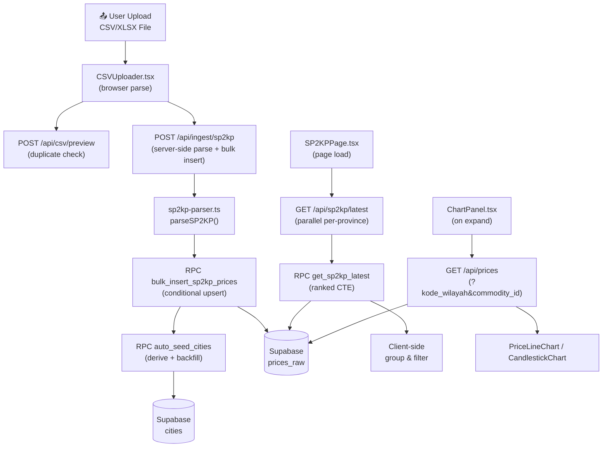

# PanganArbitrage V2 — Project Summary & Code Review

> **Tanggal review**: 30 April 2026  
> **Stack**: Next.js 14 (App Router) · TypeScript · Supabase · Tailwind 3 · Recharts  
> **Deploy**: Vercel  
> **Status**: Phase 1 — SP2KP tab live, tab lain placeholder

---

## 1. Ringkasan Proyek

**PanganArbitrage** adalah dashboard pemantauan harga komoditas pangan yang bersumber dari data **SP2KP (Sistem Pemantauan Pasar & Kebutuhan Pokok)** Kementerian Perdagangan RI. Cakupan wilayah: **Jawa, Madura, Bali, Lombok** (prefix BPS `31`–`36`, `51`, `52`), tracking **17 komoditas pokok** (beras, cabai, bawang, daging, dll).

### Fitur Utama (Phase 1)
1. **Upload & Ingest CSV/XLSX** — parse file Tabulasi_SP2KP, preview stats, bulk upsert ke Supabase
2. **Dashboard SP2KP** — dual-view (By City / By Commodity), accordion drill-down, search, filter island/provinsi
3. **Charts** — Daily line chart (30 hari) + Weekly/Monthly OHLC candlestick (1 tahun), HET reference line
4. **Analytics** — Change %, volatility, vs average, trend sparkline, anomaly detection (> HET)
5. **Admin** — Cities management page, Transport Vendor page, Arbitrase calculator (partial)

---

## 2. Struktur Proyek

```
PanganArbitrageV2/commodity-dashboard/
├── src/
│   ├── app/                         # Next.js App Router
│   │   ├── layout.tsx               # Root layout (fonts, metadata)
│   │   ├── page.tsx                 # Redirect → /dashboard/sp2kp
│   │   ├── globals.css              # Design system (174 lines)
│   │   ├── api/                     # API Routes
│   │   │   ├── csv/preview/         # POST — parse file, return stats (no insert)
│   │   │   ├── ingest/sp2kp/        # POST — parse + chunked bulk RPC insert
│   │   │   ├── prices/              # GET — daily price series for chart
│   │   │   ├── sp2kp/latest/        # GET — RPC get_sp2kp_latest, parallel fetch
│   │   │   ├── health/              # GET — diagnostic endpoint (DB probing)
│   │   │   ├── cities/              # GET/PATCH — cities CRUD
│   │   │   └── transport-vendors/   # GET/POST — transport vendor data
│   │   └── dashboard/
│   │       ├── layout.tsx           # Dashboard shell (Topbar + Sidebar + CSV modal)
│   │       ├── sp2kp/page.tsx       # SP2KP page wrapper
│   │       ├── pedagang/page.tsx    # Vendor Transport page
│   │       ├── arbitrase/page.tsx   # Arbitrase calculator
│   │       └── admin/cities/        # Admin cities management
│   ├── components/
│   │   ├── layout/
│   │   │   ├── Topbar.tsx           # Top navigation bar + upload button
│   │   │   └── Sidebar.tsx          # Left sidebar with section navigation
│   │   ├── sp2kp/
│   │   │   ├── SP2KPPage.tsx        # Main orchestrator (state, filters, views)
│   │   │   ├── CityRow.tsx          # Level 1 accordion — city group (By City)
│   │   │   ├── CommodityRow.tsx     # Level 2 row — commodity under city
│   │   │   ├── CommodityGroupRow.tsx# Level 1 accordion — commodity group (By Commodity)
│   │   │   ├── CitySubRow.tsx       # Level 2 row — city under commodity
│   │   │   └── ChartPanel.tsx       # Chart + stats panel (D/W/M modes)
│   │   ├── charts/
│   │   │   ├── PriceLineChart.tsx   # Daily price line (Recharts)
│   │   │   └── CandlestickChart.tsx # OHLC candlestick (custom Recharts shape)
│   │   ├── csv/
│   │   │   └── CSVUploader.tsx      # Upload modal (drop zone, preview, ingest)
│   │   ├── pills/
│   │   │   ├── ChangePill.tsx       # ▲/▼ price change badge
│   │   │   ├── VolatilityPill.tsx   # Volatility level badge
│   │   │   └── MiniSparkline.tsx    # 4-point SVG sparkline
│   │   ├── admin/
│   │   │   └── AdminCitiesPage.tsx  # City management CRUD
│   │   ├── arbitrase/
│   │   │   └── ArbitrasePage.tsx    # Arbitrase calculator (33.6 KB)
│   │   └── pedagang/
│   │       └── VendorTransportPage.tsx # Transport vendor management (32.9 KB)
│   ├── lib/
│   │   ├── csv/
│   │   │   └── sp2kp-parser.ts      # CSV/XLSX parser (309 lines, core logic)
│   │   ├── analytics/
│   │   │   └── metrics.ts           # Calculation functions + formatters
│   │   ├── supabase/
│   │   │   ├── client.ts            # Browser-side Supabase client
│   │   │   └── server.ts            # Server-side client (anon + service role)
│   │   └── utils/
│   │       └── date.ts              # Indonesian date formatters
│   └── types/
│       └── sp2kp.ts                 # TypeScript interfaces (93 lines)
├── supabase/
│   ├── setup.sql                    # Consolidated migrations (535 lines)
│   └── migrations/                  # 13 incremental migration files
│       ├── 001_schema_core.sql      # Tables: cities, commodities, prices_raw
│       ├── 002_seed_commodities.sql # 17 SP2KP commodities
│       ├── 003_get_sp2kp_latest_fn.sql # Main RPC function
│       ├── 004_auto_seed_cities.sql # Auto-derive cities from ingest
│       ├── 005_bulk_insert_fn.sql   # Conditional upsert RPC
│       ├── 006_rls_policies.sql     # Row Level Security
│       ├── 007_filter_future_dates.sql # Block future date columns
│       ├── 008_security_definer.sql
│       ├── 009_sp2kp_include_all_cities.sql
│       ├── 010_seed_jakarta_cities.sql
│       ├── 011_seed_latlong.sql
│       ├── 012_transport_vendors.sql
│       └── 013_transport_vendors_v2.sql
├── scripts/
│   └── seed-latlong.mjs             # One-off seeder for city coordinates
├── package.json                     # Dependencies
├── tailwind.config.ts
├── vercel.json
└── CLAUDE.md                        # Project brain/context document
```

---

## 3. Data Flow



---

## 4. Database Schema

### Core Tables

| Table | Purpose | Key Columns |
|-------|---------|-------------|
| `cities` | Wilayah (kab/kota), auto-seeded from ingest | `kode_wilayah` (BPS code, UNIQUE), `name`, `province`, `island`, `entity_type`, `lat`, `lng` |
| `commodities` | 17 komoditas pokok SP2KP | `name` (UNIQUE), `unit`, `category` (bumbu/pokok/protein), `is_sp2kp` |
| `prices_raw` | Harga harian per kota × komoditas | `date`, `city_raw`, `commodity_raw`, `price`, `het_ha`, `source`, `kode_wilayah`, `commodity_id` |

### Key RPCs

| RPC | Purpose |
|-----|---------|
| `get_sp2kp_latest(p_island, p_province)` | Returns latest + prev price, 30d stats, per kode_wilayah × commodity. Province/island derived inline from kode_wilayah. `SECURITY DEFINER`. |
| `bulk_insert_sp2kp_prices(p_rows jsonb)` | Conditional upsert: INSERT new, UPDATE changed, SKIP unchanged. Uses `xmax = 0` trick. |
| `auto_seed_cities()` | Insert new cities from prices_raw, backfill `city_id` references. |

### Key Constraints
- `prices_raw` UNIQUE on `(date, city_raw, commodity_raw, source)`
- RLS: public SELECT only for `source='sp2kp'` with `kode_wilayah` and `commodity_id` NOT NULL
- Future dates blocked in both parser (`todayIso` filter) and RPC (`date <= CURRENT_DATE`)

---

## 5. Key Design Decisions

| Decision | Rationale |
|----------|-----------|
| **Raw display via `kode_wilayah`** | No JOIN to `cities` table — avoid dependency on city canonicalization (Phase 2) |
| **Price × 1000 at parse** | SP2KP stores prices in thousands; single conversion point in parser |
| **Parallel per-province fetch** | PostgREST 1000-row limit workaround; each province < 650 rows |
| **CSV raw header extraction** | Bypass XLSX's US-locale M/D/Y auto-detection for DD/MM/YYYY Indonesian dates |
| **Client-side grouping** | All filtering/grouping after initial RPC fetch — no extra DB calls |
| **File re-upload for ingest** | Don't hold 22MB parsed rows in browser memory; re-parse on server |
| **`window.location.reload()` after ingest** | Simplest approach for Phase 1; no global state management yet |

---

## 6. Code Quality Review

### ✅ Strengths

1. **Solid domain modeling** — `CLAUDE.md` is an excellent living document that captures all business rules, edge cases, and technical decisions. This is rare and very valuable.

2. **Robust parser** — `sp2kp-parser.ts` (309 lines) handles:
   - Binary vs text detection (magic bytes)
   - Multiple encodings (UTF-8, UTF-16 LE, BOM detection)
   - Excel serial dates + DD/MM/YYYY string dates
   - Future date filtering
   - Monotonicity check for date format consistency warnings
   - Detailed parse warnings

3. **Type safety** — Well-defined TypeScript interfaces in `types/sp2kp.ts` covering all data shapes (`ParsedRow`, `SP2KPLatestRow`, `CandleData`, etc.)

4. **Smart upsert pattern** — The `bulk_insert_sp2kp_prices` RPC uses conditional ON CONFLICT with `IS DISTINCT FROM` + `xmax = 0` trick to differentiate insert/update/skip — efficient and informative.

5. **Defensive coding** — URL sanitization in `server.ts`, null handling throughout, graceful Supabase connection failures, abort patterns in useEffect.

6. **Good separation** — Parser, analytics, types, and components are cleanly separated. The `lib/` layer has no UI dependencies.

7. **Idempotent DB setup** — `setup.sql` consolidates all migrations and can be re-run safely.

---

### ⚠️ Areas for Improvement

#### Architecture & Structure

| Issue | Severity | Detail |
|-------|----------|--------|
| **God components** | 🟡 Medium | `ArbitrasePage.tsx` (33.6 KB, ~900+ lines) and `VendorTransportPage.tsx` (32.9 KB) are monolithic. Should be decomposed into sub-components. |
| **Duplicate sorting/anomaly logic** | 🟡 Medium | HET anomaly check (`r.price_latest > r.het_ha * 1.02`) is copy-pasted in `CityRow`, `CommodityGroupRow`, `CitySubRow`, `CommodityRow`, and `SP2KPPage`. Extract to shared utility. |
| **CommodityRow ≈ CitySubRow** | 🟡 Medium | These two components are ~80% identical (same grid columns, same stat rendering). Could share a base `DetailRow` component. |
| **Inline styles vs CSS classes** | 🟠 Low-Med | Mix of Tailwind utilities (`flex`, `items-center`), custom CSS classes (`.l1-row`, `.pill`), and inline `style={{...}}` within the same component. Pick a consistent approach. |
| **No error boundary** | 🟡 Medium | React error boundaries are missing. A crash in one component takes down the entire page. |
| **No loading skeleton** | 🟠 Low | Plain text "Memuat data SP2KP..." — a skeleton/shimmer would feel more polished. |

#### Data & Performance

| Issue | Severity | Detail |
|-------|----------|--------|
| **No data caching** | 🟡 Medium | Every island filter change triggers a full re-fetch. Consider `SWR` or `React Query` for stale-while-revalidate. |
| **Chart re-fetches on every expand** | 🟠 Low-Med | Opening the same commodity twice makes duplicate API calls. Cache fetched chart data in component state or a context. |
| **`commodityMetrics()` called during sort** | 🟠 Low | `sortCommodityGroups()` recomputes `commodityMetrics()` for every pair during comparison (O(n² × m)). Pre-compute and memoize. |
| **No pagination** | 🟠 Low | "Semua" view loads all provinces in parallel (~2000+ rows). Fine for now, but won't scale. |

#### Code Quality

| Issue | Severity | Detail |
|-------|----------|--------|
| **`any` type in CandlestickChart** | 🟠 Low | `type RcPayload = any;` — Recharts shape props should be typed properly. |
| **`window.location.reload()`** | 🟠 Low | Hard reload after ingest success. Phase 2 should use state management or router refresh. |
| **Duplicated province/island mapping** | 🟡 Medium | The `kode_wilayah → province` CASE statement appears in 4 places: `setup.sql` (×2), `sp2kp/latest/route.ts`, and `CLAUDE.md`. Single source of truth should be the SQL function only. |
| **Magic number `1.02`** | 🟠 Low | HET threshold `> het_ha * 1.02` (2% tolerance) is hardcoded in 6 places. Extract to a named constant. |
| **No unit tests** | 🔴 High | Zero test files. The parser, metrics, and date utilities are pure functions — perfect candidates for unit testing. |
| **No `.env.example` aligned** | 🟠 Low | `.env.example` exists but has only 3 vars (153 bytes). Should document `SUPABASE_SERVICE_ROLE_KEY` too. |

#### Security

| Issue | Severity | Detail |
|-------|----------|--------|
| **No auth** | 🟡 Medium | Ingest endpoint is publicly accessible. Anyone can POST data. Phase 2 should add auth. |
| **Service role key in `.env.local`** | 🟠 Low | Present in repo (551 bytes). Ensure `.env.local` is in `.gitignore` (it is). |
| **`SECURITY DEFINER` on RPC** | 🟠 Low | `get_sp2kp_latest` runs as the function owner (bypasses RLS). Acceptable for read-only, but document the reasoning. |

---

### 📊 Code Metrics Summary

| Metric | Value |
|--------|-------|
| **Total source files** | ~35 (excluding config) |
| **TypeScript components** | 18 |
| **API routes** | 7 |
| **SQL migrations** | 13 |
| **Total TS/TSX LOC** | ~3,200 |
| **CSS LOC** | ~174 |
| **SQL LOC** | ~535 (setup.sql) |
| **Test files** | 0 ❌ |
| **Dependencies** | 7 runtime, 10 dev |

---

## 7. Recommendations (Prioritized)

### 🔴 High Priority
1. **Add unit tests** for `sp2kp-parser.ts`, `metrics.ts`, `date.ts` — these are pure functions with complex logic and edge cases
2. **Extract anomaly constants** — `HET_THRESHOLD = 1.02` as a shared constant
3. **Add error boundaries** — at least at the dashboard layout level

### 🟡 Medium Priority
4. **Break up god components** — `ArbitrasePage.tsx` and `VendorTransportPage.tsx` into smaller sub-components
5. **Extract shared `DetailRow`** — deduplicate `CommodityRow` and `CitySubRow`
6. **Add data caching** — `useSWR` or `React Query` for API calls
7. **Add auth middleware** — protect ingest/admin routes

### 🟠 Low Priority
8. **Standardize styling approach** — choose Tailwind or custom CSS, not both
9. **Add loading skeletons** for better perceived performance
10. **Type Recharts props** — remove `any` from `CandlestickChart`
11. **Pre-compute sort metrics** — avoid O(n²) in commodity sorting

---

## 8. Phase 2 Scope (dari CLAUDE.md)

Fitur yang masih placeholder:
- **Tab Pedagang** — data harga dari pedagang (multi-source)
- **Tab Komparasi** — cross-source comparison (SP2KP vs Pedagang)
- **Tab Arbitrase** — AI suggestion engine + manual calculator (partial)
- **Admin** — Naming Queue, Commodity Queue, Ingest Log
- **City canonicalization** — matching nama kota antar sumber data
- **Approval gate** — untuk data cross-source sebelum display
